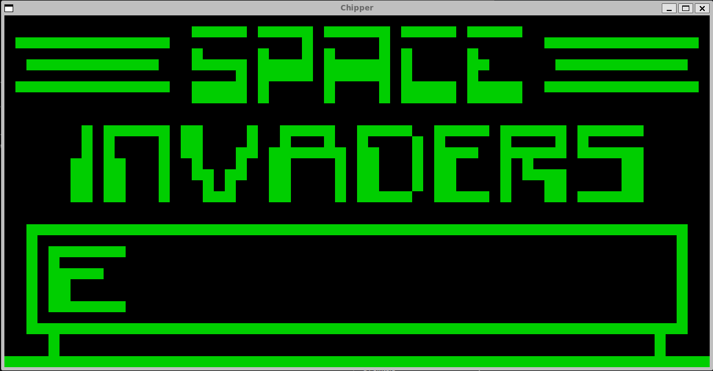

# Chipper

Cross-platform CHIP8 emulator with SDL2!

### Instructions:

1. Clone repository
2. Install libsdl2-dev (`sudo apt-get install libsdl2-dev` on Ubuntu, for example)
3. Run `cmake -S . -B build` in the top directory
4. Run `make -C build/` in the top director to build
5. Start playing with `.build/src/chipper 1500 0 path_to_rom.ch8`

Run command: `./chipper [int: delay_timer] [int: debug_flag] [str: path_to_rom]`

Different games play best with different delay_timer values, if the game is playing too fast, increase the delay_timer. If too slow, decrease!

### Current Status:

All Op-Codes implemented

Passing CHIP-8 test ROMs

### To-Do:

1. Sound
2. Color pallette selection

### Screenshots

